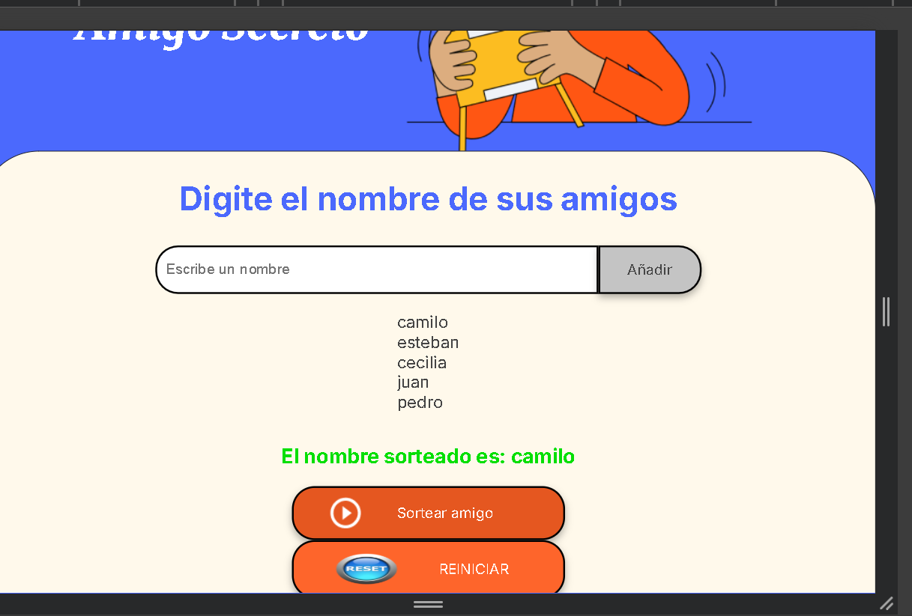

# 🎁 Desafío Amigo Secreto

Este proyecto es una aplicación web  para realizar un sorteo de **Amigo Secreto**, permitiendo a los usuarios agregar nombres, sortear aleatoriamente y reiniciar la lista.

## 🚀 Tecnologías Utilizadas

- **HTML** → Estructura del sitio web.
- **CSS** → Estilos y diseño visual.
- **JavaScript** → Funcionalidad del sorteo y gestión de nombres.

## 📌 Funcionalidades

✅ Agregar nombres a la lista (validando que sean válidos).  
✅ Mostrar la lista de participantes en tiempo real.  
✅ Realizar un sorteo aleatorio entre los nombres ingresados.  
✅ Reiniciar la lista y limpiar el resultado del sorteo.  

## 📋 Cómo Usarlo

1️⃣ Ingresa un nombre en el campo de texto y presiona **"Agregar"**.  
2️⃣ Repite el paso anterior para añadir más participantes.  
3️⃣ Haz clic en **"Sortear"** para elegir un nombre aleatorio.  
4️⃣ Si deseas empezar de nuevo, presiona **"Reiniciar"**.  

## 📷 Capturas de Pantalla

_Añadir aquí imágenes de la aplicación en funcionamiento._

## 🛠 Mejoras Futuras

🔹 Evitar nombres repetidos en la lista.  
🔹 Agregar estilos más atractivos con CSS.  
🔹 Hacer que cada nombre solo pueda ser sorteado una vez.  

## 👨‍💻 Autor

Proyecto desarrollado por **Ianjaner Alfonso Beltrán Gañarita**.  

---
✨ ¡Diviértete sorteando tu Amigo Secreto! 🎉
